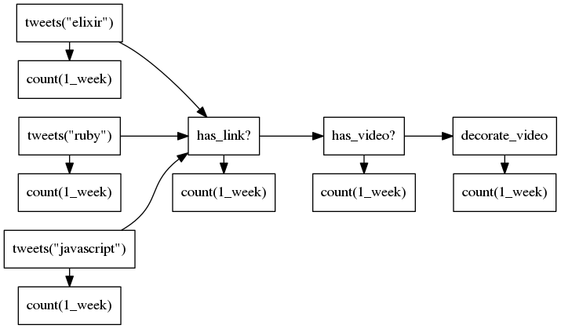

# ProbablyWorthWatching

This is a tool for executing a pipeline topology.  Specifically, it streams
tweets through a pipeline to extract videos greater than 5 minutes long that are
linked to from a given twitter search, tracking provenance of the search, so
that it can produce an API endpoint for the latest videos from a given 'topic'
of Twitter users.

## Layout

The pipeline we're building is as follows:

